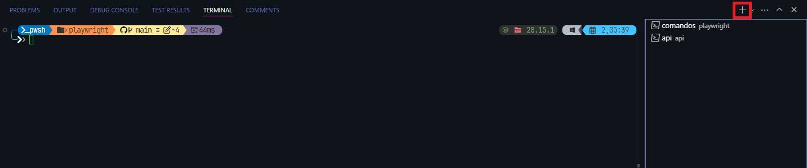
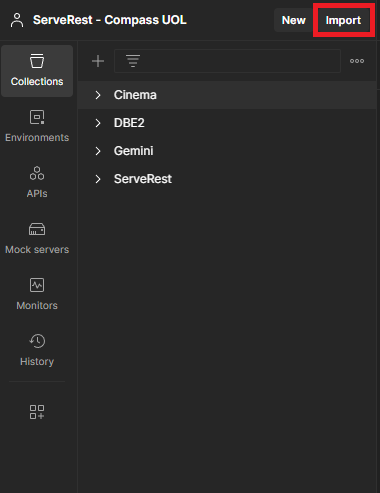
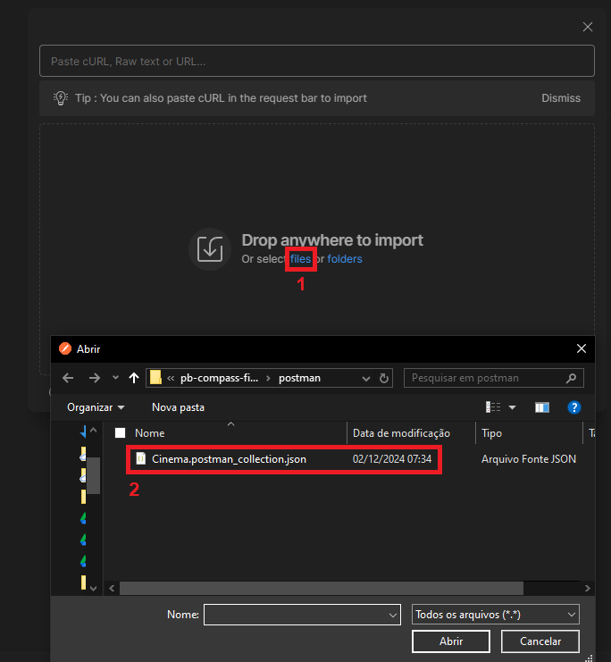

<div align="center">
  
  <h1>Programa de Bolsa: Software Quality Engineer</h1>
</div>

## 📝 Sobre o Projeto

Este projeto é uma suíte de testes de Qualidade para a API [nestjs-cinema](https://github.com/juniorschmitz/nestjs-cinema/tree/main), desenvolvida como challenge final do Programa de Bolsas Software Quality Engineer da Compass UOL na área de QA.

## 👤 Autora

### Olá, eu sou a Júlia Peter! 👋

Estudante de 20 anos do quarto semestre do curso Técnologo em Sistemas para Internet no campus Pelotas no Instituto Federal Sul-riograndense e participante do programa de bolsas de Software Quality Engineer na Compass UOL.
- 😄 Pronomes: she/her
- 📫 Contato: juliagpeter0@gmail.com


## 📦 Instalação

### Requisitos

Antes de começar, você precisará de algumas ferramentas instaladas em sua máquina:

- [Git](https://git-scm.com/downloads) — para controle de versão e clonagem do repositório.
- [Node.js](https://nodejs.org/) — para gerenciar as dependências e executar os testes.
- [Postman](https://www.postman.com/) — para realizar testes manuais.
- [K6](https://k6.io/) — para realizar testes de desempenho.

### 📝 Passo a Passo

Siga as etapas abaixo para configurar o projeto e iniciar o servidor.

1. **Clone o repositório**
   Clone este repositório para a sua máquina local:
   ```bash
   git clone https://github.com/juliagpeter/pb-compass-final
   git remote remove origin   # Para evitar conflitos 
   ```

2. **Instale as dependências da API**
   Navegue até o diretório da API e instale as dependências necessárias:
   ```bash
   cd api
   npm install
   ```

3. **Inicie a API localmente**
   ```bash
   npm run start
   ```
   > O servidor será iniciado na URL [http://localhost:3000](http://localhost:3000) por padrão (a menos que a porta já esteja em uso).

4. **Instale as dependências do Playwright**
   
   Para facilitar a execução do projeto, dentro do Visual Studio Code, inicie outro terminal:

   

   Navegue até o diretório do Playwright e instale as dependências necessárias:

      ```bash
   cd playwright
   npm install
   ```

   Pronto! Agora está tudo pronto para começar a executar os testes.

---

## 🚀 Executando os Testes

## Postman

Coleção de testes manuais no Postman está disponivel [aqui](postman/Cinema.postman_collection.json)

Baixe o arquivo e importe dentro do aplicativo do Postman:





Teste as rotas de maneira manual.

### Playwright

#### Todos os Testes

Para executar **todos** os testes automatizados, execute o seguinte comando:

Certifique=se de estar no diretório do Playwright

```bash
npx playwright test
```

> **Atenção**: Todos os testes serão executados nos três navegadores suportados (Chromium, Firefox e WebKit), o que pode levar algum tempo.

#### Testes Individuais

Para rodar um teste específico, use o comando abaixo:

```bash
npx playwright test nomeDoTeste
```

Exemplo:

```bash
npx playwright test loginok
```

Após a execução, o terminal exibirá os resultados dos testes, como mostrado abaixo:


### 📊 Gerando Relatório no Playwright

Você pode gerar um relatório detalhado dos testes utilizando o Allure. Siga os passos abaixo:

#### 1. Gerar Relatório

Após rodar os testes, use o seguinte comando para gerar o relatório de resultados:

```bash
allure generate ./allure-results -o ./allure-report
```

#### 2. Abrir o Relatório

Para visualizar o relatório gerado no navegador, execute:

```bash
allure open ./allure-report
```

### K6

#### Todos os testes

Para executar **todos** os testes automatizados, execute o seguinte comando:

Certifique-se de estar no diretório do K6.

```bash
node run-tests.js
```

> **Atenção**: Todos os testes serão executados e pode levar algum tempo.

#### Testes Individuais

Para rodar um teste específico, use o comando abaixo:

```bash
k6 run nomeDoTeste.js
```

Exemplo:

```bash
k6 run stress-test.js
```

---

## 📁 Estrutura do Diretório

A estrutura do projeto está organizada da seguinte forma:

```plaintext

PB-COMPASS-FINAL/
│
├── api/                         # Diretório reservado para API
│   └── cypress/        
│       └── e2e/                 # Diretório dos testes
│
├── assets/                      # Arquivos de mídia e estáticos
│
├── k6/                          # Diretório para scripts de teste de carga com K6
│   ├── reports/
│   │     └── report.pdf         # Relatório gerado pelos testes de carga
│   │
│   ├── run-tests.js             # Script para execução geral de testes
│   │  
│   └── scripts/
│         ├── create-movie.js           # Script para criar filmes
│         ├── create-ticket.js          # Script para criar tickets
│         ├── get-movie.js              # Script para obter um filme específico
│         ├── get-movies-list.js        # Script para listar filmes
│         ├── stress-test.js            # Script para teste de estresse
│         ├── update-movie.js           # Script para atualizar filmes
│         ├── zdelete-movie.js          # Script para deletar filmes
│         └──               
│
├── playwright/                     # Diretório para testes de automação com Playwright
│   └── tests/                      
│      ├── movies/
│      │   ├── negativo/            # Testes negativos relacionados a filmes
│      │   └── positivo/            # Testes positivos relacionados a filmes
│      ├── tickets/
│      │   ├── negativo/            # Testes negativos relacionados a tickets
│      │   └── positivo/            # Testes positivos relacionados a tickets
│      └── fluxoPrincipal.spec.js   # Teste principal cobrindo o fluxo completo
│
├── util/                        # Utilitários e configurações adicionais
│
├── postman/                              # Arquivos para uso com o Postman
│   └── Cinema.postman_collection.json    # Coleção de requisições da API para Postman
│
├── mapa-mental.pdf              # Arquivo com o mapa mental do projeto
├── plano-de-teste.md            # Documento detalhando o plano de testes
│
├── .gitignore                   # Arquivo para ignorar arquivos/diretórios no Git
├── package-lock.json            # Registro das dependências instaladas
├── package.json                 # Dependências e scripts do projeto
├── playwright.config.js         # Configuração do Playwright
└── README.md                    # Documentação principal do projeto
```

---

## 📘 Comandos Adicionais

Aqui estão alguns comandos úteis para auxiliar na manutenção do projeto:

- **Limpar Relatórios Antigos do Allure**:
   Caso você precise limpar os resultados anteriores do Allure, use o seguinte comando:
   ```bash
   allure generate ./allure-results --clean
   ```

---

## 💬 Contato

Se você tiver dúvidas ou sugestões, fique à vontade para entrar em contato:

- [GitHub](https://github.com/juliagpeter/pb-compass-final) — GitHub do projeto.
- Abra uma **issue** diretamente no repositório para discutir melhorias ou relatar problemas.

---

> Para mais informações sobre a ferramenta **Playwright**, consulte a [documentação oficial do Playwright](https://playwright.dev/). 
> Para mais informações sobre a ferramenta **K6**, consulte a [documentação oficial do K6](https://grafana.com/docs/k6/latest/). 

---
