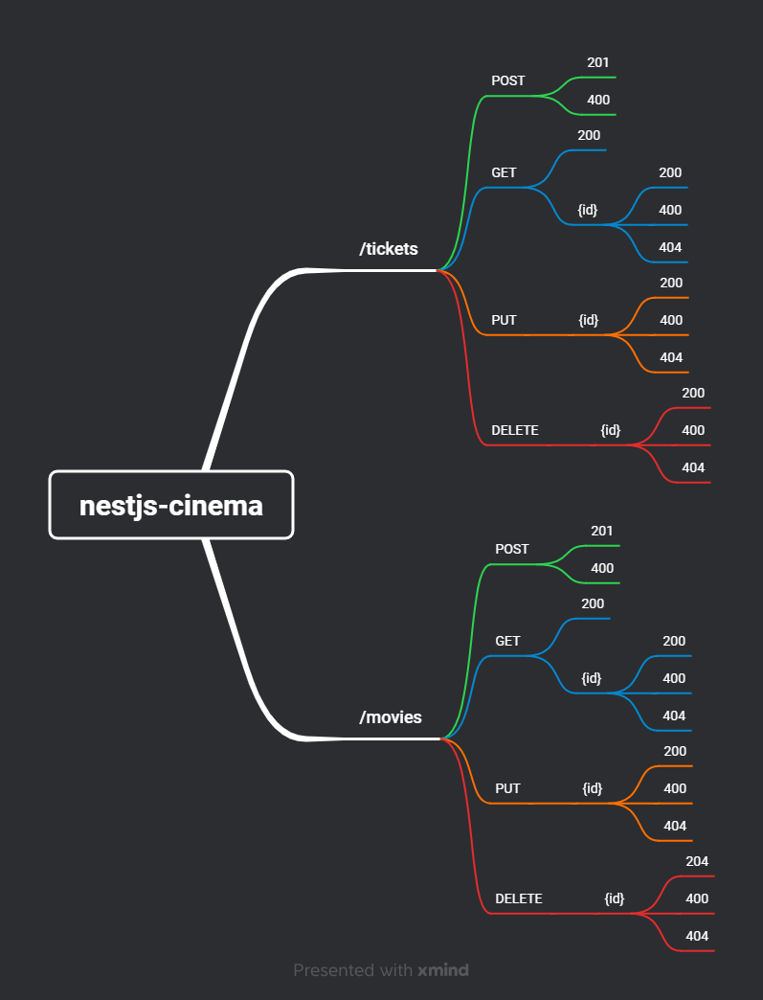

# Plano de teste - nestjs-cinema

Esse documento apresenta o plano de teste completo da API nestjs-cinema, incluindo os seguintes pontos:
- Objetivo
- Mapa Mental
- Requisitos Funcionais e Não Funcionais
- Acceptance Criteria
- DoR (Definition of Ready)
- DoD (Definition of Done)
- Cenários de teste

## Objetivos do Plano de Testes

- Verificar o funcionamento correto dos endpoints conforme especificado.
- Garantir a validação dos dados de entrada.
- Confirmar que as respostas retornadas pela API estão completas e no formato esperado.
- Testar cenários de sucesso e falha.

## Mapa Mental
> O mapa a seguir representa a API como o Swagger descreve, no entanto apresenta algumas incongruências em relação aos critérios de aceitação.


> Versão corrigida do mapa:

 

## Prompt

Para incrementar esse plano de teste, foi utilizado a ferramenta do ChatGPT seguindo o seguinte prompt como base:

> Assuma o papel de um QA Senior e me auxilie a aprimorar esse plano de testes, incrementando novos pontos essenciais e melhorando a coesão do documento.

A partir desse ponto fui adaptando as preferências da inteligência artificial para que aprimorasse o plano de testes da melhor forma possível.

## Requisitos Funcionais e Não Funcionais

### /movies

#### Requisitos Funcionais:

1. **Criando um Novo Filme**:
    - O usuário administrador da API envia uma solicitação POST para o endpoint /movies com os detalhes do filme.
    - O sistema valida os campos obrigatórios e a unicidade do título.
    - Se as validações passarem, o sistema cria o filme e atribui um ID único.
    - O sistema retorna uma resposta de sucesso com o status 201 Created, incluindo o ID do filme.
2. **Obtendo a Lista de Filmes**:
    - O usuário envia uma solicitação GET para o endpoint /movies.
    - O sistema retorna uma lista de todos os filmes cadastrados com detalhes.
3. **Obtendo Detalhes de um Filme por ID**:
    - O usuário envia uma solicitação GET para o endpoint /movies/{id}, onde {id} é o ID do filme desejado.
    - O sistema verifica a existência do filme e retorna seus detalhes.
    - Se o filme não existir, o sistema retorna uma resposta de erro com o status 404 Not Found.
4. **Atualizando os Detalhes de um Filme por ID**:
    - O usuário administrador da API envia uma solicitação PUT para o endpoint /movies/{id}, onde {id} é o ID do filme a ser atualizado.
    - O sistema verifica a existência do filme, permite a atualização de campos específicos e valida os dados.
    - Se todas as validações passarem, o sistema atualiza os detalhes do filme.
    - O sistema retorna uma resposta de sucesso com o status 200 OK e os detalhes atualizados do filme.
5. **Excluindo um Filme por ID**:
    - O usuário administrador da API envia uma solicitação DELETE para o endpoint /movies/{id}, onde {id} é o ID do filme a ser excluído.
    - O sistema verifica a existência do filme e o remove permanentemente do banco de dados.
    - O sistema retorna uma resposta de sucesso com o status 204 No Content.

#### Requisitos Não Funcionais de Performance:

- A API deve ser capaz de processar pelo menos 100 solicitações de criação de filmes por segundo.
- O tempo médio de resposta para a criação de um novo filme não deve exceder 200 milissegundos.
- A API deve ser capaz de responder a solicitações GET de listagem de filmes em menos de 100 milissegundos.
- A lista de filmes deve ser paginada, com no máximo 20 filmes por página.
- A API deve ser capaz de responder a solicitações GET de detalhes de um filme em menos de 50 milissegundos.
- A API deve ser capaz de processar pelo menos 50 solicitações de atualização de filmes por segundo.
- O tempo médio de resposta para a atualização dos detalhes de um filme não deve exceder 300 milissegundos.
- A API deve ser capaz de processar pelo menos 30 solicitações de exclusão de filmes por segundo.
- O tempo médio de resposta para a exclusão de um filme não deve exceder 400 milissegundos.

### /tickets

#### Requisitos Funcionais:

1. O usuário envia uma solicitação POST para o endpoint /tickets com os seguintes detalhes do ingresso:
    - ID do Filme (movieId) - Identifica o filme para o qual o ingresso está sendo reservado.
    - ID do Usuário (userId) - Identifica o usuário que está fazendo a reserva.
    - Número do Assento (seatNumber) - O número do assento que o usuário deseja reservar.
    - Preço do Ingresso (price) - O preço do ingresso para o filme.
    - Data de Apresentação (showtime) - A data e hora da apresentação do filme.
2. O sistema valida se todos os campos obrigatórios estão preenchidos corretamente.
3. O sistema verifica se o número do assento está dentro do intervalo de 0 a 99.
4. O sistema verifica se o preço do ingresso está dentro do intervalo de 0 a 60.
5. Se todas as validações passarem, o sistema cria uma reserva de ingresso com os detalhes fornecidos.
6 O sistema atribui um ID único à reserva de ingresso.
7. O sistema retorna uma resposta de sucesso com o status 201 Created, incluindo o ID da reserva de ingresso.

#### Requisitos Não Funcionais de Performance:

- A API deve ser capaz de processar pelo menos 50 solicitações de reserva de ingressos por segundo.
- O tempo médio de resposta para a reserva de um ingresso não deve exceder 300 milissegundos.

## Acceptance Criteria

### **Movies**

#### **Criar Filme**  
Como administrador, quero criar um novo filme.

**Critérios de aceitação:**  
- A criação de um filme deve retornar o status **201** quando os dados fornecidos forem válidos.  
- O corpo da resposta deve conter uma mensagem de confirmação: *"Filme criado com sucesso."*.  
- Os campos obrigatórios para criação são:
  - `title`: Deve ser uma string não vazia.
  - `description`: Deve ser uma string.
  - `launchdate`: Deve estar no formato ISO (YYYY-MM-DD).
  - `showtimes`: Deve ser um array contendo strings no formato ISO.  
- Caso algum campo obrigatório esteja ausente ou inválido, deve retornar o status **400** e uma mensagem de erro clara, indicando o campo com problema.

---

#### **Atualizar Filme:**

**Como administrador, quero atualizar os detalhes de um filme existente.**

**Critérios de aceitação:**  
- A atualização de um filme deve retornar o status **200** quando o ID for válido e os dados fornecidos forem corretos.  
- O corpo da resposta deve conter uma mensagem de confirmação: *"Filme atualizado com sucesso."*.  
- Os campos que podem ser atualizados são:
  - `title`: Deve ser uma string não vazia.
  - `description`: Deve ser uma string.
  - `launchdate`: Deve estar no formato ISO (YYYY-MM-DD).
  - `showtimes`: Deve ser um array contendo strings no formato ISO.  
- Caso o ID não exista, deve retornar o status **404** e uma mensagem: *"Filme não encontrado."*.  
- Caso os dados fornecidos sejam inválidos, deve retornar o status **400** e uma mensagem clara indicando o problema.

---

#### **Buscar Filmes:**  
Como usuário, quero buscar todos os filmes disponíveis para visualizar a lista completa de opções.

**Critérios de aceitação:**  
- A listagem de filmes deve retornar o status **200**.  
- O corpo da resposta deve conter um array de filmes.  
- Cada filme deve incluir os seguintes campos:  
  - `title` (string).  
  - `description` (string).  
  - `launchdate` (string no formato ISO).  
  - `showtimes` (array de strings no formato ISO).  
  - `_id` (string).  
- Caso não haja filmes cadastrados, o corpo da resposta deve ser um array vazio.

---

#### **Buscar Filme por ID:**  
Como usuário, quero buscar um filme específico pelo ID para visualizar seus detalhes.

**Critérios de aceitação:**  
- A busca por um filme deve retornar o status **200** quando o ID for válido e existir.  
- O corpo da resposta deve conter todos os detalhes do filme, incluindo:  
  - `title`, `description`, `launchdate`, `showtimes`, `_id`.  
- Caso o ID não exista, deve retornar o status **404** e uma mensagem de erro, como: *"Filme não encontrado."*.  

---

#### **Excluir Filme**

**Como administrador, quero excluir um filme do sistema.**

**Critérios de aceitação:**  
- A exclusão de um filme deve retornar o status **200** quando o ID for válido.  
- O corpo da resposta deve conter uma mensagem de confirmação: *"Filme excluído com sucesso."*.  
- Caso o ID não exista, deve retornar o status **404** e uma mensagem: *"Filme não encontrado."*.  

---

### **Tickets**

#### **Criar Ticket:**  
Como cliente, quero criar um ticket para assistir a um filme em um horário específico.

**Critérios de aceitação:**  
- A criação de um ticket deve retornar o status **201** quando os dados fornecidos forem válidos.  
- O corpo da resposta deve incluir os dados do ticket criado:  
  - `movieId`: ID do filme.  
  - `quantity`: Número do assento.  
  - `showtime`: Horário da sessão no formato ISO.  
- Caso algum campo obrigatório esteja ausente ou inválido:
  - Deve retornar o status **400**.
  - A resposta deve conter uma mensagem indicando o erro, como: *"O campo movieId é obrigatório."*.  

---

  #### **Atualizar Ticket**

**Como administrador, quero atualizar os detalhes de um ticket existente.**

**Critérios de aceitação:**  
- A atualização de um ticket deve retornar o status **200** quando o ID for válido e os dados fornecidos forem corretos.  
- O corpo da resposta deve conter uma mensagem de confirmação: *"Ticket atualizado com sucesso."*.  
- Os campos que podem ser atualizados são:
  - `quantity`: Deve ser um número inteiro positivo.
  - `showtime`: Deve estar no formato ISO (YYYY-MM-DD).  
- Caso o ID não exista, deve retornar o status **404** e uma mensagem: *"Ticket não encontrado."*.  
- Caso os dados fornecidos sejam inválidos, deve retornar o status **400** e uma mensagem clara indicando o problema.

---

#### **Buscar Tickets:**  
Como cliente, quero visualizar a lista de tickets que comprei para confirmar minhas reservas.

**Critérios de aceitação:**  
- A listagem de tickets deve retornar o status **200**.  
- O corpo da resposta deve conter um array de tickets.  
- Cada ticket deve incluir os seguintes campos:  
  - `movieId`, `quantity`, `showtime`, `_id`.  
- Caso não existam tickets cadastrados, o corpo da resposta deve ser um array vazio.  

---

#### **Buscar Ticket por ID:**  
Como cliente, quero buscar os detalhes de um ticket específico pelo ID para verificar informações da minha reserva.

**Critérios de aceitação:**  
- A busca por um ticket deve retornar o status **200** quando o ID for válido e existir.  
- O corpo da resposta deve conter todos os detalhes do ticket, incluindo:  
  - `movieId`, `quantity`, `showtime`, `_id`.  
- Caso o ID não exista, deve retornar o status **404** e uma mensagem de erro, como: *"Ticket não encontrado."*.  

---

#### **Excluir Ticket:**  
Como cliente, quero excluir um ticket para cancelar minha reserva.

**Critérios de aceitação:**  
- A exclusão de um ticket deve retornar o status **200** quando o ID for válido e existir.  
- O corpo da resposta pode confirmar a exclusão ou ser vazio.  
- Caso o ID não exista, deve retornar o status **404** e uma mensagem de erro, como: *"Ticket não encontrado."*.  

---

## **DoR (Definition of Ready)**  
Os critérios que uma história de usuário ou tarefa técnica precisa atender antes de ser considerada **pronta** para o desenvolvimento:

- [ ] **Critérios de Aceitação Claros**: Os critérios de aceitação estão definidos e compreendidos pela equipe.
- [ ] **Requisitos Documentados**: Todos os requisitos funcionais e não funcionais estão documentados no backlog.
- [ ] **Design do Sistema Disponível**: Diagramas de fluxo, modelo de dados, ou arquitetura estão acessíveis.
- [ ] **Histórias Priorizadas**: As histórias de usuário e tarefas estão priorizadas conforme a necessidade do projeto.
- [ ] **Ambiente de Testes Preparado**: O ambiente de teste está configurado e pronto para receber as alterações.
- [ ] **Plano de Testes Pronto**: O plano de testes cobre cenários de sucesso e falha adequadamente.
- [ ] **Critérios Não Funcionais**: Metas de desempenho da API estão claramente definidas.

---

## **DoD (Definition of Done)**  
Os critérios que indicam que uma história de usuário ou tarefa técnica foi **concluída** com sucesso:

- [ ] **Código Implementado**: Todos os endpoints foram implementados conforme os requisitos.
- [ ] **Cobertura de Testes**: Testes automatizados (unidade e integração) foram escritos com pelo menos 80% de cobertura.
- [ ] **Testes de Playwright Concluídos**: Todos os testes funcionais passaram nos cenários estabelecidos.
- [ ] **Testes de Carga Realizados**: Testes de carga foram executados com K6, e os requisitos de performance foram validados.
- [ ] **Revisão de Código**: O código foi revisado e aprovado por outro desenvolvedor.
- [ ] **Deploy em Homologação**: A aplicação foi implantada no ambiente de homologação e testada sem erros.
- [ ] **Documentação Atualizada**: A documentação da API e diagramas foram atualizados conforme necessário.
- [ ] **Sem Bugs Abertos**: Todos os bugs críticos foram corrigidos e o backlog de bugs está vazio ou controlado.

---

## Cenários de teste
Os cenários de teste serão descritos utilizando a linguagem Gherkin, que segue uma estrutura baseada em comportamento (BDD - Behavior Driven Development). Isso garante que os cenários sejam compreensíveis tanto para desenvolvedores quanto para pessoas não técnicas.

### /movies

#### **Criar um novo filme**
```gherkin
Feature: Criar um novo filme

  Scenario: Administrador cria um novo filme com dados válidos
    Given que o administrador está autenticado na API
    When ele envia uma solicitação POST para o endpoint /movies com os detalhes do filme
    Then a API deve retornar o status 201 Created
    And o corpo da resposta deve incluir a mensagem "Filme criado com sucesso" e o ID do filme

  Scenario: Administrador tenta criar um filme com dados inválidos
    Given que o administrador está autenticado na API
    When ele envia uma solicitação POST para o endpoint /movies com dados faltando ou inválidos
    Then a API deve retornar o status 400 Bad Request
    And o corpo da resposta deve incluir uma mensagem clara indicando o campo com problema
```

#### **Obter lista de filmes**
```gherkin
Feature: Obter lista de filmes

  Scenario: Usuário obtém a lista de filmes
    Given que o usuário está autenticado na API
    When ele envia uma solicitação GET para o endpoint /movies
    Then a API deve retornar o status 200 OK
    And o corpo da resposta deve conter um array de filmes com título, descrição, data de lançamento e horários de exibição

  Scenario: Nenhum filme cadastrado
    Given que não há filmes cadastrados na API
    When o usuário envia uma solicitação GET para o endpoint /movies
    Then a API deve retornar o status 200 OK
    And o corpo da resposta deve ser um array vazio
```

#### **Obter detalhes de um filme por ID**
```gherkin
Feature: Obter detalhes de um filme

  Scenario: Usuário obtém os detalhes de um filme existente
    Given que o filme com ID "123" existe
    When o usuário envia uma solicitação GET para o endpoint /movies/123
    Then a API deve retornar o status 200 OK
    And o corpo da resposta deve conter os detalhes do filme, como título, descrição, data de lançamento e horários de exibição

  Scenario: Usuário tenta obter os detalhes de um filme inexistente
    Given que o filme com ID "999" não existe
    When o usuário envia uma solicitação GET para o endpoint /movies/999
    Then a API deve retornar o status 404 Not Found
    And o corpo da resposta deve incluir a mensagem "Filme não encontrado"
```

#### **Atualizar um filme**
```gherkin
Feature: Atualizar um filme

  Scenario: Administrador atualiza os detalhes de um filme com sucesso
    Given que o administrador está autenticado na API
    And o filme com ID "123" existe
    When ele envia uma solicitação PUT para o endpoint /movies/123 com novos detalhes válidos
    Then a API deve retornar o status 200 OK
    And o corpo da resposta deve incluir a mensagem "Filme atualizado com sucesso"

  Scenario: Administrador tenta atualizar um filme inexistente
    Given que o administrador está autenticado na API
    And o filme com ID "999" não existe
    When ele envia uma solicitação PUT para o endpoint /movies/999 com novos detalhes
    Then a API deve retornar o status 404 Not Found
    And o corpo da resposta deve incluir a mensagem "Filme não encontrado"
```

#### **Excluir um filme**
```gherkin
Feature: Excluir um filme

  Scenario: Administrador exclui um filme com sucesso
    Given que o administrador está autenticado na API
    And o filme com ID "123" existe
    When ele envia uma solicitação DELETE para o endpoint /movies/123
    Then a API deve retornar o status 200 OK
    And o corpo da resposta deve incluir a mensagem "Filme excluído com sucesso"

  Scenario: Administrador tenta excluir um filme inexistente
    Given que o administrador está autenticado na API
    And o filme com ID "999" não existe
    When ele envia uma solicitação DELETE para o endpoint /movies/999
    Then a API deve retornar o status 404 Not Found
    And o corpo da resposta deve incluir a mensagem "Filme não encontrado"
```

---

### /tickets

#### **Criar um ticket**
```gherkin
Feature: Criar um ticket

  Scenario: Cliente cria um ticket com dados válidos
    Given que o cliente está autenticado na API
    And o filme com ID "123" existe
    When ele envia uma solicitação POST para o endpoint /tickets com os detalhes do ticket
    Then a API deve retornar o status 201 Created
    And o corpo da resposta deve incluir os dados do ticket criado, como movieId, quantidade, showtime e ID do ticket

  Scenario: Cliente tenta criar um ticket com dados inválidos
    Given que o cliente está autenticado na API
    When ele envia uma solicitação POST para o endpoint /tickets com dados faltando ou inválidos
    Then a API deve retornar o status 400 Bad Request
    And o corpo da resposta deve incluir uma mensagem clara indicando o erro
```

#### **Atualizar um ticket**
```gherkin
Feature: Atualizar um ticket

  Scenario: Administrador atualiza os detalhes de um ticket com sucesso
    Given que o administrador está autenticado na API
    And o ticket com ID "456" existe
    When ele envia uma solicitação PUT para o endpoint /tickets/456 com novos detalhes válidos
    Then a API deve retornar o status 200 OK
    And o corpo da resposta deve incluir a mensagem "Ticket atualizado com sucesso"

  Scenario: Administrador tenta atualizar um ticket inexistente
    Given que o administrador está autenticado na API
    And o ticket com ID "999" não existe
    When ele envia uma solicitação PUT para o endpoint /tickets/999
    Then a API deve retornar o status 404 Not Found
    And o corpo da resposta deve incluir a mensagem "Ticket não encontrado"
```

#### **Buscar tickets**
```gherkin
Feature: Buscar tickets

  Scenario: Cliente visualiza a lista de tickets comprados
    Given que o cliente está autenticado na API
    When ele envia uma solicitação GET para o endpoint /tickets
    Then a API deve retornar o status 200 OK
    And o corpo da resposta deve conter um array de tickets com movieId, quantidade, showtime e ID

  Scenario: Cliente tenta buscar tickets mas não existem tickets cadastrados
    Given que o cliente está autenticado na API
    And não há tickets cadastrados
    When ele envia uma solicitação GET para o endpoint /tickets
    Then a API deve retornar o status 200 OK
    And o corpo da resposta deve ser um array vazio
```

#### **Buscar ticket por ID**
```gherkin
Feature: Buscar ticket por ID

  Scenario: Cliente visualiza os detalhes de um ticket existente
    Given que o cliente está autenticado na API
    And o ticket com ID "456" existe
    When ele envia uma solicitação GET para o endpoint /tickets/456
    Then a API deve retornar o status 200 OK
    And o corpo da resposta deve incluir os detalhes do ticket, como movieId, quantidade, showtime e ID

  Scenario: Cliente tenta buscar um ticket inexistente
    Given que o cliente está autenticado na API
    And o ticket com ID "999" não existe
    When ele envia uma solicitação GET para o endpoint /tickets/999
    Then a API deve retornar o status 404 Not Found
    And o corpo da resposta deve incluir a mensagem "Ticket não encontrado"
```

#### **Excluir um ticket**
```gherkin
Feature: Excluir um ticket

  Scenario: Cliente exclui um ticket com sucesso
    Given que o cliente está autenticado na API
    And o ticket com ID "456" existe
    When ele envia uma solicitação DELETE para o endpoint /tickets/456
    Then a API deve retornar o status 200 OK
    And o corpo da resposta pode confirmar a exclusão ou ser vazio

  Scenario: Cliente tenta excluir um ticket inexistente
    Given que o cliente está autenticado na API
    And o ticket com ID "999" não existe
    When ele envia uma solicitação DELETE para o endpoint /tickets/999
    Then a API deve retornar o status 404 Not Found
    And o corpo da resposta deve incluir a mensagem "Ticket não encontrado"
```