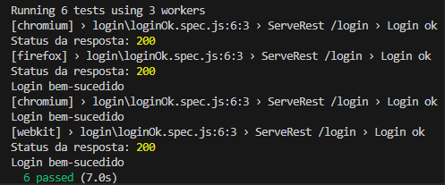

<div align="center">
  
  <h1>Programa de Bolsa: Software Quality Engineer</h1>
</div>

# 🎭 Playwright

O Playwright é uma biblioteca Node.js para automatizar o Chromium, Firefox e Safari com uma única API. Ele possibilita testes de ponta a ponta confiáveis para aplicativos web modernos. A ferramenta foi escolhida para esse projeto devido à sua robustez e versatilidade na automação de testes. 

## 📁 Estrutura do diretório

Os testes em Playwright estão organizados da seguinte maneira:

```plaintext

├── playwright/                    
│   └── tests/                      # Pasta principal
│      ├── movies/
│      │   ├── negativo/            # Testes negativos relacionados a filmes
│      │   └── positivo/            # Testes positivos relacionados a filmes
│      ├── tickets/
│      │   ├── negativo/            # Testes negativos relacionados a tickets
│      │   └── positivo/            # Testes positivos relacionados a tickets
│      └── fluxoPrincipal.spec.js   # Teste principal cobrindo o fluxo completo
```

✅ Testes positivos: Representam os cenários bem-sucedidos da aplicação. 

❌ Testes negativos: Representa os cenários com falhas esperadas da aplicação.


#### Todos os Testes

Para executar **todos** os testes automatizados, execute o seguinte comando:

Certifique=se de estar no diretório do Playwright

```bash
npx playwright test
```

> **Atenção**: Todos os testes serão executados nos três navegadores suportados (Chromium, Firefox e WebKit), o que pode levar algum tempo.

#### Testes Individuais

Para rodar um teste específico, use o comando abaixo:

```bash
npx playwright test nomeDoTeste
```

Exemplo:

```bash
npx playwright test loginok
```

Após a execução, o terminal exibirá os resultados dos testes, como mostrado abaixo:




### 📊 Gerando Relatório no Playwright

Você pode gerar um relatório detalhado dos testes utilizando o Allure. Siga os passos abaixo:

#### 1. Gerar Relatório

Após rodar os testes, use o seguinte comando para gerar o relatório de resultados:

```bash
allure generate ./allure-results -o ./allure-report
```

#### 2. Abrir o Relatório

Para visualizar o relatório gerado no navegador, execute:

```bash
allure open ./allure-report
```

#### 3. Limpar Relatórios Antigos do Allure

Caso você precise limpar os resultados anteriores do Allure, use o seguinte comando:

```bash
allure generate ./allure-results --clean
```
